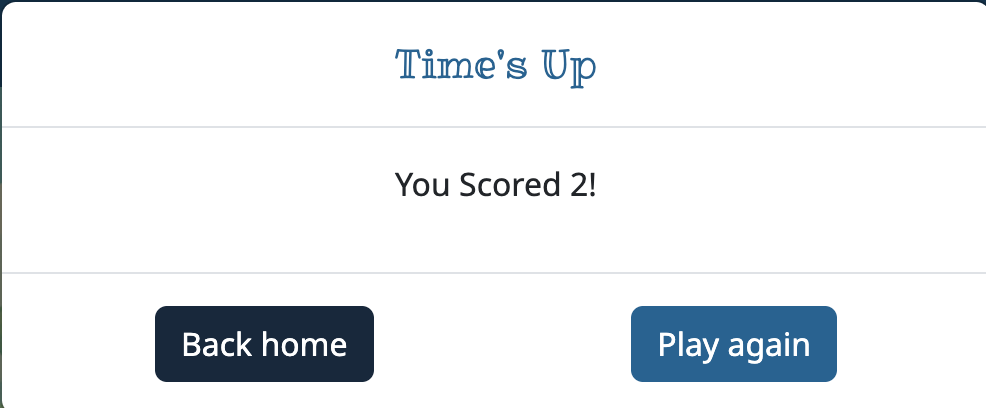

# Spot it!
## Poject Goals
### As a developer
The main project goal is to showcase my abilities to build an interactive website using JavaScript and that follows the best practices for web development.
### As a game
Spot it! is a game inspired by Dobble. The Goal of the game is to spot the matching symbol between both cards. In this single player version the objective is to find as many before the time runs out. Every time you find the matching symbol the cards will shuffle showing new symbols.

## Design Choices
The website was designed for mobile phone screens first, since you can only fit two game cards in a smartphone screen. It was then adapted to be responsive for larger screens using bootstrap’s grid and flexbox properties.

### Fonts
The fonts were imported from Google fonts.

Noto Sans as the primary font.

Ribeye Marrow as the secondary font, used for all the headings.

### Colour palette
The colour palette was chosen from coolors.co

• Primary colour; #006494.
• Secondary colour; #13293D.
• Highlight colour; #1B98E0.
• Highlight colour light; #E8F1F2.

## User stories
* As a user, I need to know the rules and objectives of the game so I can know if the game is of my liking or not.

  * Acceptance Criteria: 
    The website contains a dedicated Section to explain the main objective.
  * Tasks:
    Design and place a section for game objectives.

    

* As a user, I need easy navigation and user friendly design so I can easily start the game without frustration.

  * Acceptance Criteria: 
    The website is responsive across various screen sizes.
    The layout and navigation are intuitive.
  * Tasks:
    Apply responsive design using Bootstrap.
    Arrange the navigation based on best practices. 
    

* As a game enthusiast, I want to know how well I did after each game so I can try to beat my best score.
  * Acceptance Criteria: 
    The websites gives the user feedback after each game.
  * Tasks:
    Use Bootstrap to display a modal with the score after the game is ended. 
    

## Technologies Used
I used VS code as my IDE. After every change I would save and upload the code to gitHub using the git commands in the terminal.

The languages used were HTML, CSS and JavaScript. Bootstrap was also used for its responsive grid and flex properties.

## Deployment
The website was deployed with gitHub. For this I used VS Code as my IDE to build the site, then I would use git commands to save and upload my work onto gitHub.

To deploy the website on gitHub:

* I opened my project in gitHub.
* Went to settings.
* In settings select Pages in the code and automation section.
* Selected main as the branch.
* Select root as the folder.
* Once those settings were saved, the website deployed a couple of seconds after.

## Testing
### Manual Testing
#### Principles of manual testing
You impersonate a user of the application and manually test everything by clicking on the buttons and interacting with the website. You would:

* Check if the game works according to user stories.
* Test the website is responsive to different screen sizes.
* Test that all internal links work.

This method of testing is used toward the end of deployment, when all the main features are introduced and responsiveness to different screen sizes is applied.

### Automated Testing
#### Principles of automated testing
We use code to test our code.

Jest (a Javascript framework) was used to write automated tests for the main features of the game.

W3C Markup Validation service used on all HTML pages and received no errors.

W3C CSS Validation service used on the style.css sheet and received no errors.

JSlint validation service used on the script.js sheet and received no major errors.

Used Lighthouse in the chrome developer tools to test performance, accessibility and best practices. This gave me a good overall score.

For readability and contract tests I used webaim.org.

## Feature deployments
Some ideas for future deployments would be:

* Create different game modes or difficulties by increasing the number of symbols or cards and reducing the time.
* Introduce a feature to prevent spam tapping all the symbols by maybe only giving one or two chances of guessing the correct one.

## Credits
* The project was created using The Codes Institute's template
* The color palette was chosen from coloors.co
* The fonts were imported from Google fonts
* All images were created with ChatGPT
* All images were optimized for web with tinypng.com
* All favicons were imported from favicon.io
